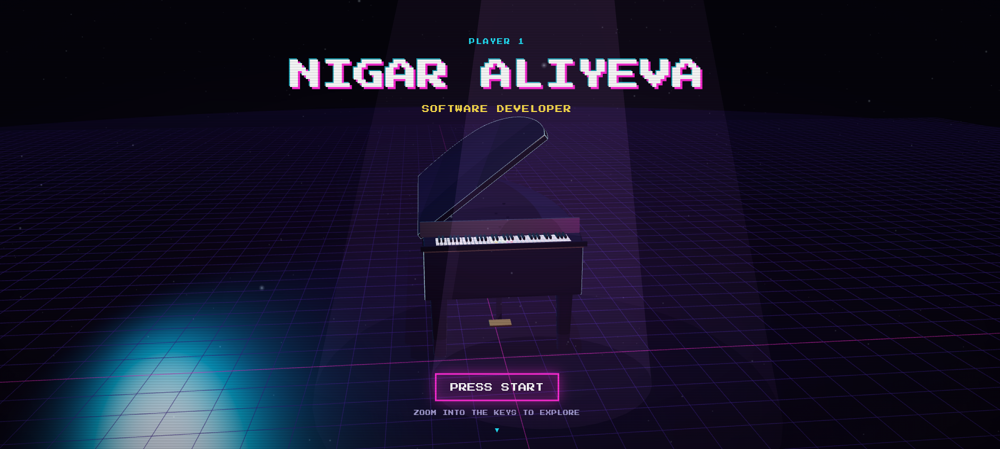

# Nigar Aliyeva Interactive Portfolio
 
A portfolio built around a 3D grand piano. Instead of scrolling through sections, you zoom into the keyboard and each of the six keys opens a different part of my profile — Home, About, Skills, Projects, Experience, Contact. Plain HTML, CSS and JavaScript on top of three.js, no framework, no build step.



---
 
## Why a piano?
 
I've played piano since I was a child, and it's stayed one of the constants (of course, I gave up multiple times) through a few career changes now — petroleum engineering, teaching, and now software development. When I started planning this portfolio I didn't just want a resume in website form; I wanted it to say something about me beyond the job skills, and the piano was the obvious personal thread to pull on.
 
The other thing I wanted to show is that I enjoy building things just to see if I can — small games, interactive toys, whatever gives me an excuse to make something respond when you click it. A portfolio that's actually an interactive scene to explore, rather than a page to scroll, felt like the right format for that.
 
---
 
## Features
 
- 3D piano intro, zoomed into by scrolling, clicking, or pressing Enter
- Six navigation keys (also reachable with number keys 1–6, arrows once open)
- XP bar, score, and a "stage unlocked" popup on first visit to each stage
- Flat, clickable fallback if WebGL isn't available
- No build step, just open `index.html` or serve the folder
---
 
## Tech stack
 
- Vanilla HTML / CSS / JavaScript
- three.js for the 3D scene 
- Web Audio API for the key-press sounds
---
 
## Project structure
 
```
.
├── index.html   # page structure, filled in by main.js
├── style.css    # all styling
├── data.js      # all site content
├── main.js      # page logic, stage rendering, HUD
├── piano.js     # the 3D piano

---
## Still to do
 
- Fill in the remaining `TODO`s in `data.js`
